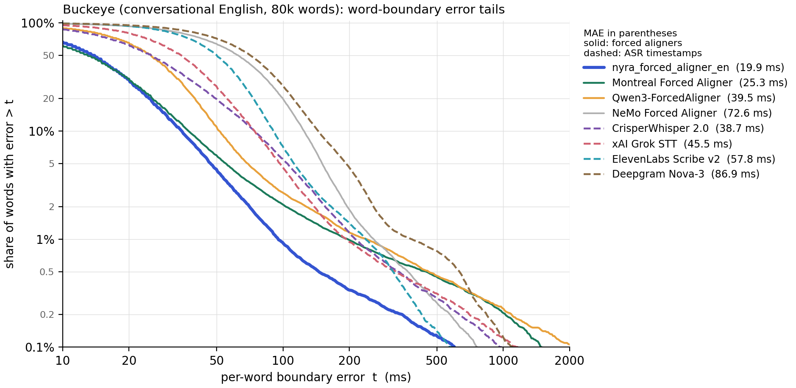

# nyra-forced-aligner

[](https://pypi.org/project/nyra-forced-aligner/)
[](https://huggingface.co/nyralabs)

**The most accurate word timing you can get for conversational speech:
verbatim-aware, noise-robust, and fast.**

[Blog post](https://nyra-labs.com/research/nyra-forced-aligner) ·
[Paper](#) <!-- TODO: ICASSP 2026 link --> ·
[Models](https://huggingface.co/nyralabs) ·
[PyPI](https://pypi.org/project/nyra-forced-aligner/) ·
[CrisperWhisper](https://github.com/nyrahealth/CrisperWhisper)

A forced aligner answers one question: given a recording and its transcript,
*when* was each word said? Most aligners were built for read speech and clean
audio, and they quietly fall apart on the material people actually need to
align: conversations full of `um`s, laughter, restarts and half-finished words,
recorded in rooms that are not studios.

`nyra-forced-aligner` was built for exactly that material.

- **Vocal sounds are alignable.** Fillers (`[UH]`, `[UM]`), laughter, breaths,
  coughs and word cut-offs (`th-`) are units of the model like any phone,
  so they get timestamps of their own instead of being smeared into the
  neighbouring words.
- **Made for CrisperWhisper transcripts.** Trained on the verbatim
  transcription convention of
  [CrisperWhisper 2.0](https://github.com/nyrahealth/CrisperWhisper): feed
  its output straight in and every filler, repetition and event token is
  aligned.
- **Accurate where it matters.** 19.9 ms mean word-boundary error on
  conversational English (Buckeye): 21% lower than the best configuration of
  the Montreal Forced Aligner, half the error of the best ASR-with-timestamps
  system, and the only system whose error tail drops below 1% of words before
  100 ms.
- **Noise-robust.** Every utterance stays aligned down to 0 dB SNR, where
  classical aligners lose or mangle most of them. A Pro model goes further for
  difficult recordings.
- **Fast and longform.** Batched WavLM features, GPU emissions and a compiled
  beam Viterbi: eight minutes of audio align in about three seconds on one
  GPU.

## Install

```bash
pip install nyra-forced-aligner

# espeak-ng is needed to pronounce words outside the built-in 41k-word lexicon:
#   apt install espeak-ng      (macOS: brew install espeak-ng)
```

Runs on CPU, but a CUDA GPU is strongly recommended (WavLM-large front-end).
The model is downloaded from the Hugging Face Hub on first use.

## Quickstart

```python
from nyra_align import Aligner

aligner = Aligner()                      # nyralabs/nyra_forced_aligner_en
# aligner = Aligner(pro=True)            # noise-robust model

result = aligner.align("interview.wav",
                       "so i [UM] i went there on on thursday [laughter]")

for w in result.words:
    print(f"{w.start:7.3f} {w.end:7.3f}  {w.word:<12s} {w.type}")   # w / f(iller) / s(ound) / c(ut-off)

result.to_textgrid("interview.TextGrid")     # Praat
result.to_json("interview.json")
```

Any audio length works. For the best timings follow the
[transcript conventions](#transcript-conventions) below.

Command line, single file or a whole corpus of paired `.wav` + `.txt`/`.lab`
files (MFA-style layout):

```bash
nyra-align interview.wav --text-file interview.txt --out interview.TextGrid
nyra-align corpus_dir/ --pro --out-dir aligned/ --format textgrid
```

### Transcript conventions

The aligner can only place what the transcript contains, so for the best
timings the transcript should be **verbatim: write what you hear.**

- **Cut-offs.** Interrupted words and word fragments are marked with a
  trailing hyphen: `th-`, `w-`, `resched-`.
- **Fillers.** Filled pauses are bracketed and upper-cased: `[UH]`, `[UM]`.
- **Vocal sound events.** Non-speech sounds are bracketed: `[laughter]`,
  `[cough]`, `[breath]`, `[sigh]`, `[sniff]`, `[lipsmack]`,
  `[throatclearing]`, `[yawn]`, `[noise]`.
- **Numbers, dates, times and emails** are written out exactly as spoken
  (`March third at nine thirty`), not as digits or symbols.
- **Everything else** is transcribed word for word. Normal casing and
  punctuation are fine (the aligner ignores both); repetitions, false starts,
  fillers, fragments and sounds are all left in place.

```text
so we we need to, to reschedule the th- Thursday meeting to [UH] March third at nine thirty [laughter]
```

What happens when a transcript deviates: a word that was spoken but is missing
from the transcript gets absorbed into its neighbours, and a word in the
transcript that was never spoken is squeezed into a few frames, so both shift
the surrounding boundaries. Event tags are matched in any casing; a tag the
model does not know (`[music]`) is left out and listed in `result.skipped`,
as is any token that cannot be pronounced.

### With CrisperWhisper 2.0

[CrisperWhisper 2.0](https://github.com/nyrahealth/CrisperWhisper) produces
transcripts in exactly this convention, so its verbatim output can be aligned
as is:

```python
from crisperwhisper import CrisperWhisperModel
from nyra_align import Aligner

audio = "interview.wav"
transcript = CrisperWhisperModel("large").transcribe(audio, language="en").text
result = Aligner().align(audio, transcript)

for w in result.words:
    print(f"{w.start:7.3f} {w.end:7.3f}  {w.word}")
result.to_textgrid("interview.TextGrid")
```

### Models

| Shorthand | Hugging Face ID | Use it for |
|-----------|-----------------|------------|
| `Aligner()` (default) | `nyralabs/nyra_forced_aligner_en` | Clean and lightly noisy audio; most accurate on clean speech |
| `Aligner(pro=True)` | `nyralabs/nyra_forced_aligner_en_pro` | **Pro**: roughly the same accuracy on clean speech, meaningfully more robust to noise and adverse acoustic conditions. Not publicly released; available on request |

Only English is available at the moment; `Aligner(language="de")` raises
`NotImplementedError`.

## Performance

Mean absolute word-boundary error on **Buckeye** (conversational English,
2,008 test recordings, 80,475 words), lower is better. Every system is scored
with the same protocol: DP word matching on canonicalized forms, laughter
tokens excluded, MAE = mean over words of (|onset error| + |offset error|)/2.

| # | System | Type | MAE (ms) | ≤25 ms | ≤50 ms | ≤100 ms | mIoU |
|--:|--------|------|---------:|-------:|-------:|--------:|-----:|
| 1 | **nyra_forced_aligner_en** | forced aligner | **19.9** | **79.5%** | **93.7%** | **98.3%** | **0.830** |
| 2 | Montreal Forced Aligner `english_us_arpa`, wide beam¹ | forced aligner | 25.3 | 76.7% | 92.2% | 97.3% | 0.826 |
| 3 | Montreal Forced Aligner `english_mfa`, wide beam¹ | forced aligner | 35.6 | 71.3% | 87.5% | 95.2% | 0.790 |
| 4 | CrisperWhisper 2.0 | ASR | 38.7 | 54.2% | 78.7% | 91.7% | 0.717 |
| 5 | Qwen3-ForcedAligner-0.6B | forced aligner | 39.5 | 52.8% | 85.9% | 96.6% | 0.711 |
| 6 | xAI Grok Speech-to-Text | ASR | 45.5 | 58.3% | 82.8% | 94.0% | 0.630 |
| 7 | Montreal Forced Aligner `english_us_arpa`, default beam | forced aligner | 48.0 | 75.2% | 90.4% | 95.6% | 0.810 |
| 8 | Montreal Forced Aligner `english_mfa`, default beam | forced aligner | 48.9 | 70.7% | 86.7% | 94.3% | 0.782 |
| 9 | MMS-FA (torchaudio) | forced aligner | 53.0 | 57.5% | 81.3% | 92.8% | 0.620 |
| 10 | ElevenLabs Scribe v2 | ASR | 57.8 | 47.6% | 75.8% | 94.8% | 0.540 |
| 11 | Charsiu | forced aligner | 70.3 | 51.8% | 68.5% | 85.1% | 0.649 |
| 12 | NeMo Forced Aligner | forced aligner | 72.6 | 26.8% | 49.8% | 79.3% | 0.443 |
| 13 | WhisperX (wav2vec2 alignment) | forced aligner | 80.9 | 35.1% | 68.1% | 94.1% | 0.456 |
| 14 | CTC-Segmentation | forced aligner | 81.0 | 41.5% | 69.5% | 89.3% | 0.635 |
| 15 | Deepgram Nova-3 | ASR | 86.9 | 18.1% | 36.4% | 68.9% | 0.496 |
| 16 | Cartesia Ink-Whisper | ASR | 124.8 | 36.0% | 60.4% | 82.8% | 0.598 |

<sub>**MAE** is over the per-word error (|onset error| + |offset
error|)/2. The **≤ t ms** columns follow the convention of Rousso et
al. (2024): the share of words whose *end* timestamp is within t of the
reference (one boundary, not the per-word mean). **Forced aligners** are given
the reference words and only predict their timing; every word is scored. **ASR** systems produce their own words, which
are text-aligned to the reference, and only matched words are scored
(88–93% of words), so their timing is judged independently of their
transcription errors. ¹ MFA's shipped default beam (10) prunes the correct
path on conversational speech; the "wide beam" rows use `beam 400 / retry
4000`, the best configuration we found for it.</sub>

The mean hides where the difference really is. Averaged over all words, most
systems are within a few tens of milliseconds; the gap is in the **tail**, the
words that are misaligned by 100 ms or more, which is what breaks downstream
use. Each curve shows the share of words whose per-word error (mean of the
onset and offset errors, the quantity behind MAE) is larger than *t*; note
this is not the single-boundary ≤ t ms column of the table:



### Under noise

The same Buckeye recordings with added noise, at signal-to-noise ratios from
20 dB down to 0 dB (MAE in ms). MUSAN is real noise recordings; Gaussian is
white noise, which the model never saw in training.

| System | MUSAN 20 | 10 | 5 | 0 dB | Gauss 20 | 10 | 5 | 0 dB |
|--------|---:|---:|---:|---:|---:|---:|---:|---:|
| **nyra_forced_aligner_en** | 20.0 | 22.2 | 26.9 | 56.3 | 20.2 | 25.3 | 38.9 | 110.9 |
| CrisperWhisper 2.0² | 38.7 | 42.4 | 48.0 | 55.7 | 40.1 | 50.9 | 67.3 | 103.4 |
| Qwen3-ForcedAligner-0.6B | 40.6 | 54.3 | 78.7 | 153.9 | 43.4 | 85.2 | 153.9 | 339.2 |
| MMS-FA (torchaudio) | 52.8 | 54.9 | 57.7 | 67.0 | 52.0 | 55.2 | 61.0 | 86.1 |
| Montreal Forced Aligner `english_us_arpa`, wide beam | 33.3 | 65.3 | 127.2 | 281.2 | 36.2 | 74.4 | 156.3 | 416.9 |
| WhisperX (wav2vec2 alignment) | 81.7 | 90.4 | 138.1 | 468.5 | 84.2 | 126.3 | 415.2 | 2720.6 |

<sub>² CrisperWhisper 2.0 is an ASR system: at 0 dB it still recognises only
29% of the words, and only those are scored. All forced aligners above keep
100% of words at every SNR.</sub>

`nyra_forced_aligner_en_pro` delivers roughly the same accuracy on clean speech
and is meaningfully more robust to noise and adverse acoustic conditions.

Results on read speech (TIMIT) and stuttered speech (FluencyBank), the full
set of ablations, and how the models are trained are in the paper.

## What else is in the box

| Option | What it does |
|--------|--------------|
| `Aligner(pro=True)` | Noise-robust model |
| `Aligner(device="cuda" / "cpu")` | Device selection (auto by default) |
| `Aligner(precision="fp32")` | WavLM in fp32 instead of fp16; bit-exact parity with the reference implementation (fp16 moves ≤30 ms on ~0.5% of word boundaries) |
| `Aligner(wavlm_batch=16)` | Batch size for the 30 s WavLM windows on long audio (tune to VRAM) |
| `aligner.align_features(feats, text)` | Re-align a transcript against cached features (decode is ~6 ms per 3.5 s utterance) |
| `result.events` | Just the filler / laughter / cut-off tokens |
| `result.silences` | Silence segments between words |

## How it works

The full story is in the deep-dive post:

- [The nyra forced aligner: precise word timing for real conversational speech](https://nyra-labs.com/research/nyra-forced-aligner).
  Why classical aligners break on spontaneous and noisy speech, how frozen
  WavLM features, vocal-event units and a noise-pooled projection fix it, and
  how the model bootstraps itself from verbatim transcripts without any
  manual boundary labels.

In short: WavLM-large hidden states are projected by a supervised LDA onto 40
dimensions and modelled by a triphone GMM-HMM whose inventory holds 15
vocal-event units next to the 39 English phones. At inference the package
builds the alignment graph for the transcript (optional silence between words,
full context across word boundaries) and runs a compiled beam Viterbi over the
model's likelihoods, with a beam ladder so that no utterance is ever silently
dropped. Words outside the built-in lexicon are phonemized with espeak through
the same mapping used at training time.

## License

The model files are released under the
[nyra health Non-Commercial Research License](https://huggingface.co/nyralabs/nyra_forced_aligner_en/blob/main/LICENSE.md):
free for research and other non-commercial use. This license covers the
model **and the alignments it produces**: any commercial use of the
timestamps, and any use of them to train, fine-tune or otherwise improve
models intended for commercial use, requires a commercial license. The Pro
model is available under commercial license only. For commercial licensing
of either, [contact nyra health](mailto:licensing@nyra-labs.com).

The model repositories bundle Microsoft's WavLM-large weights, redistributed
unchanged under their upstream license.
